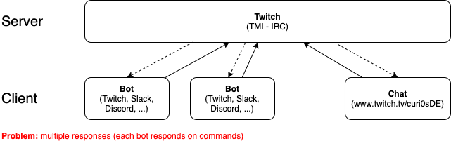
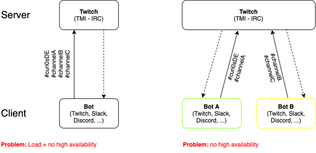
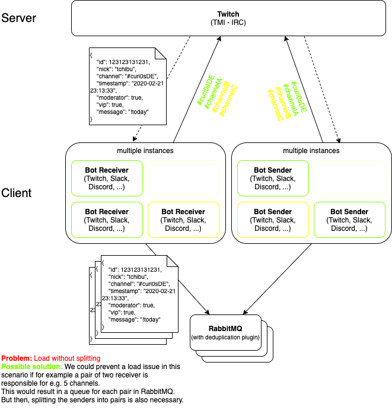

# Stream #002 (2020-02-21)

**Main topic:** Running bots in a high availability setup

## Topics

### Todos

Before we started with the main topic I worked on some todos.

- Reviewing all links to this repo the bot returns
- Added alias of !repository command
- Added command for !font => Fire Code V2
- Added a table to the repo [README.md](../../README.md) with all interesting information the bot would usually answer in the chat

### Running bots in a high availability setup

I began this topic by explaining what are the main problems if your business offers a service that has to be available 24/7. Bots like Nightbot or Moobot are used by so many streamers that an outage would be a huge problem and would generate a big amount of negative comments on social media. If this happens too often, the service would not be used anymore and the business dies.

To prevent this, a business has to make sure that it's service works all the time. Thats why your architecture of your service has to be build this way. But before we are coming to a solution that might work, I try to show the problems of some other setups and why they should not be used.

The Twitch chat (TMI) uses IRC ([Internet Relay Chat](https://de.wikipedia.org/wiki/Internet_Relay_Chat)). One funny fact: As already explained in [the last recap](../2020-02-15/README.md), I began really early with IT stuff instead of just playing games. To communicate (write) with each other or rather the communities of the games I played, we used IRC (programs like [mIRC](https://de.wikipedia.org/wiki/MIRC)) and as the name already says, it was also the IRC protocol. I already developed bots back then and it was quite fun I have to say :grin:.

The [Draw.io file](2020-02-21_High_available_bots.drawio) is also in this repository.

#### Starting the same bot multiple times

As shown in this image, the same bot gets started multiple times. The biggest problem with this setup is the duplication of messages. Each bot would respond on a command a user types in. If I for example would write `!today` into my chat, each bot would answer with the text of the "today" command.

#### Starting a single instance + splitting the bot up

The left side of the image is quite simple to explain. You would start the bot only a single time. The Problem, as mentioned in the image, you would not have any load balancing or high availability.

On the right side of the image I tried to illustrate, what you could do in a simple setup to overcome the problem that multiple instances of the same bot react on one command. If you split up the bot and let each instance join seperate channels, you would split up the load but you would still miss the high availability.

#### The final architecture

The little document with the JSON data in it shows a example message of a user. A bot receiver would read this message, parses it if it's a command (only the scheme - starting with a ! for example). If it's a command it would forward it to a message queue.
In this case I already wrote the product in the diagram. That's a thing you wouldn't normally do, because a evaluation is **always** useful. Multiple bot senders would subscribe to a queue to receive messages.
One thing in this scenario is mandatory. As already wrote down in the diagram we would need something to deduplicate the messages. As already mentioned in [this sections](#starting-the-same-bot-multiple-times), starting a bot multiple times would result in message duplication.
We found a [plugin](https://github.com/noxdafox/rabbitmq-message-deduplication) for deduplication in RabbitMQ to solve this problem.

This architecture should work if I didn't miss anything :sweat_smile:.

## Unexpected/Problematic things

Luckily nothing

## Lessons learned

[Draw.io](https://www.draw.io) has a dark mode: Extras => Theme => Dark

## Other stuff

- I still have a [MSI E350IA-E45](https://de.msi.com/Motherboard/E350IAE45.html) with 16 GB of ram lying around and no use for it. Any ideas?
- Maybe learning [Go](https://golang.org/) in a future stream is useful

And as always: contribute!
